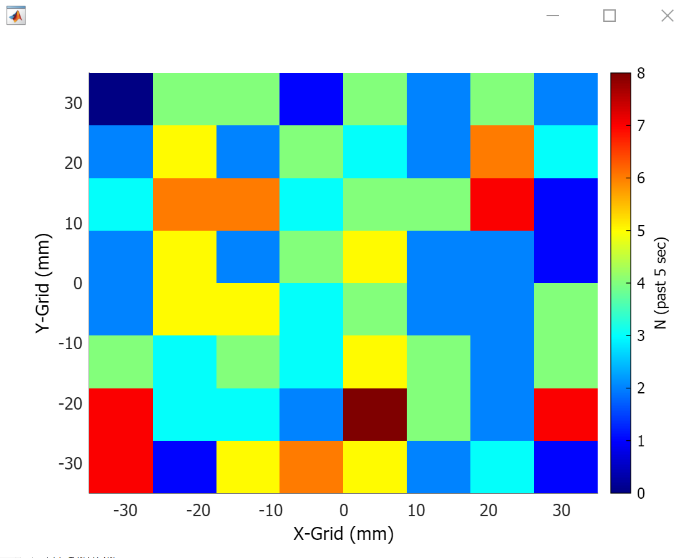
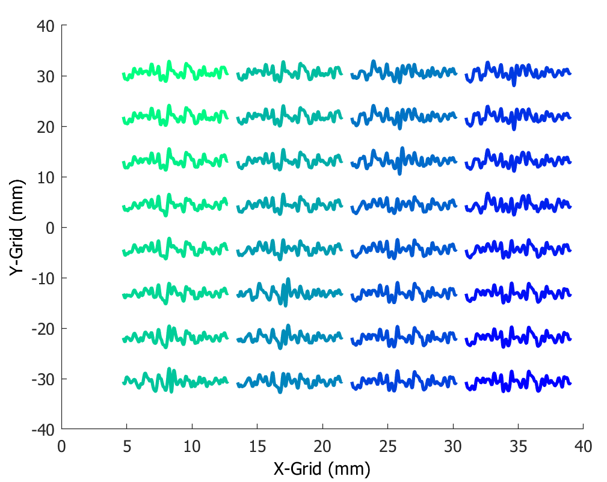
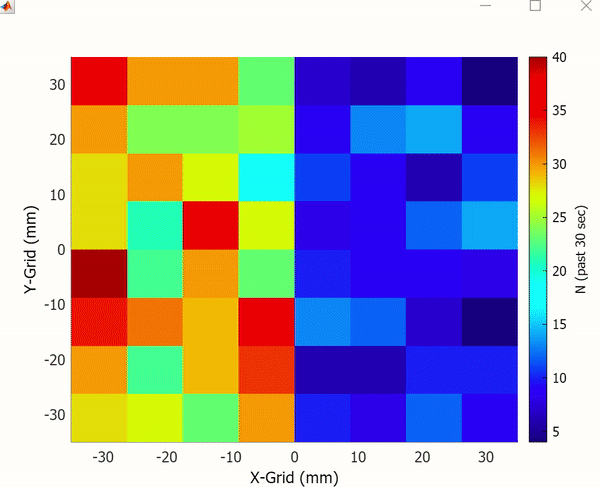
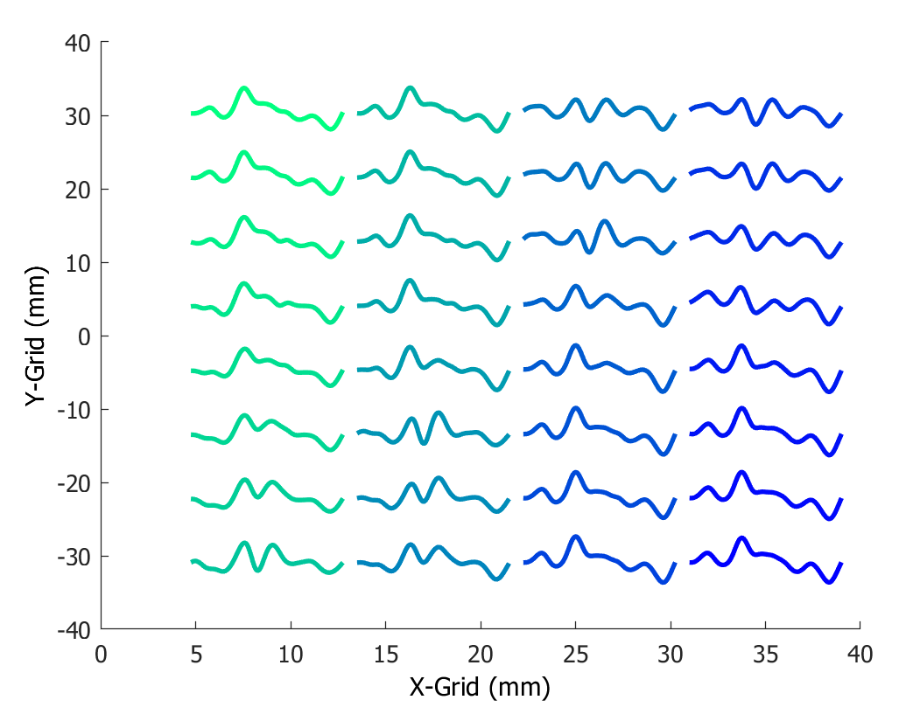

# TMSi MATLAB Plots #
Plotting utility chart classes designed to show data captured on TMSi surface EMG array grids.  

## Chart Types ##  

| Name | Example     |
| ---- | ----------- |
| [Raster](#raster) |  |
| [Snippet](#snippet) |  |

---

### Raster ###
** Example Use Case **
```(matlab)
myRaster = Raster_Array_8_8_L_Chart();
updateTimescale(myRaster, 30);
while isvalid(myRaster);
	n = randi([1,50],1,1); % How many timestamps in this time-interval?
	ch = [randi([1,32],n,1); randi([1,64],n,1)]; % Which channels were they on?
	ts = repmat(datetime('now'),2*n,1) + seconds(randn(2*n,1).*3); % Jitter in timestamps.
	myRaster.append(ch, ts);
	for ii = 1:4
		if isvalid(myRaster)
			myRaster.redraw();
			drawnow();
			pause(0.25);
		end
	end
end
```
This would produce a simulated raster heatmap that looks like the gif below.  


### Snippet ###
** Example Use Case **  
Let's say we want to visualize putative MUAP waveforms across the array and know how it "looks" in a spatial sense. This example illustrates how we can do this quickly.  
```(matlab)
load('R:\NMLShare\raw_data\primate\Darcy\Darcy_2022_10_28\Darcy_2022_10_28_A_0.mat'); % Has data in array `samples`
t = (0:((size(samples,2)-1)))./4000;
x = samples(2:33,:); % Taken from single cloth 4x8 grid

% Plot the snippets of interest
z = zscore(x, 0, 2);
z_c = z - mean(z, 1);
iSignal = (t>191.435) & (t<191.46);
figure('Name', 'Original Snippets'); 
plot(t(iSignal), z_c(:, iSignal)); 
```  
This should result in a figure which looks like the following image:  


Using only two lines of code, we can produce a spatially re-arranged version:  
```(matlab)
figure('Name', 'Spatial Snippets');
mySnippets = Snippet_Cloth_8_4_L_Chart('XData', t(iSignal)', 'YData', x(:, iSignal)');
```  
This should result in a figure which looks like the following image:  


We can also zoom out to see more of the snippets:  
```(matlab)
figure('Name', 'Spatial Snippets (Zoomed Out)');
iSignal = (t>191.4) & (t<191.5); 
set(mySnippets, 'XData', t(iSignal)', 'YData', x(:, iSignal)');
```  
This should result in a figure which looks like the following image:  
  

## Configuration ##
In `config.yaml`, you can modify existing Chart grid layout specifications following the formatting for existing montages as indicated in the file's syntax.  
Montage names refer to the spacing ("large - L or small - S", number of rows, and number of columns in the electrode grid). There are 4 default configured montages:  
* `L48` - For cloth arrays if you want to view them in "landscape" orientation.
* `L84` - For cloth arrays if you want to view them in "portrait" orientation.
* `L88` - For the standard 8x8 grids that are most-used in the lab.
* `S88` - For the small 8x8 grids.  
You can use the corresponding named subclasses and modify any of the values in the `config.yaml` corresponding to that name convention in order to change the electrode spacing if you need a different spacing than what exists (or add a category and add a corresponding chart subclass as desired). 